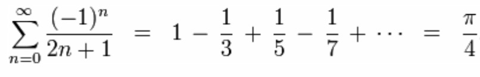
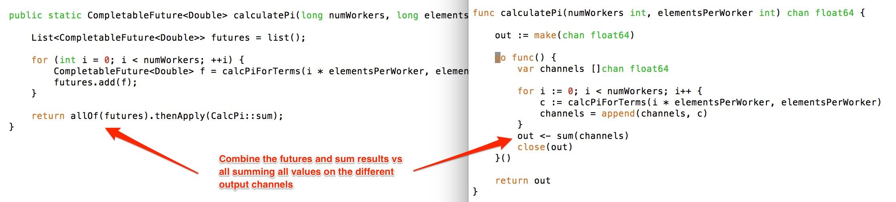
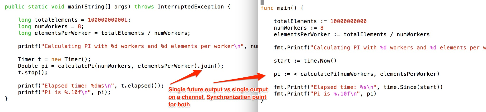
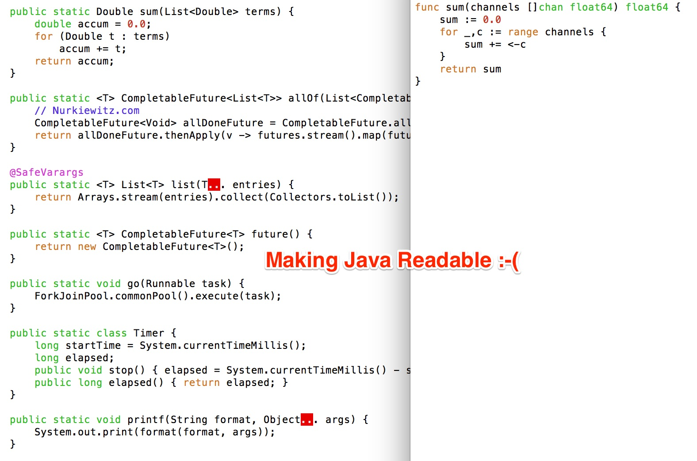

# java-go-comparison-with-pi
Here I am doing a side-by-side comparison of Java 8 CompletableFutures
with Go channels. I am not making any claims about which is better here,
but I wanted to see how the two compare for readability. My observations
are these:

* Go channels easily replace futures where composibility is straightforward
and can be expressed as a simple pipeline. CompletableFutures on the
otherhand will allow for composition in more complex ways where the
result of one completion stage may be composed with MULTIPLE other
futures. I am a Go noob so perhaps there is a pattern with channels
that would allow such composition as well.

* The flip side of the observation above is that using a single channel
for a single result is a special case for channels and does not
remotely reflect its power. CompletableFutures are not intended to solve
this. Channels therefore possess both the power of the actor model
AND the simplicity of futures in one very simple abstraction.

* I cheated considerably with helper fucntions to make the Java 8 look
comparable in simplicity to go. It's clear that having concurrency
front and center in the language design of Go makes it considerably
more readable. Note also that while I wrote the Go code to look as
similar as possible to the Java code, that made the Go implementation
slightly larger than it needed to be because the functions return
a separate channel for each result in the way that Java returns
a separate future for each result. In Go, using a fan-in pattern,
several workers can contribute to the same output channel with a
single consumer reading the channel and summing the results. This
version can be seen in calcipi2.go

* The go implementation was considerably faster however I have not
yet optimized the Java setup to allow for warming up. Go requires
no such special treatment and ran nearly twice as fast out of the box.

* * *

* * *

* * *

* * *

* * *

